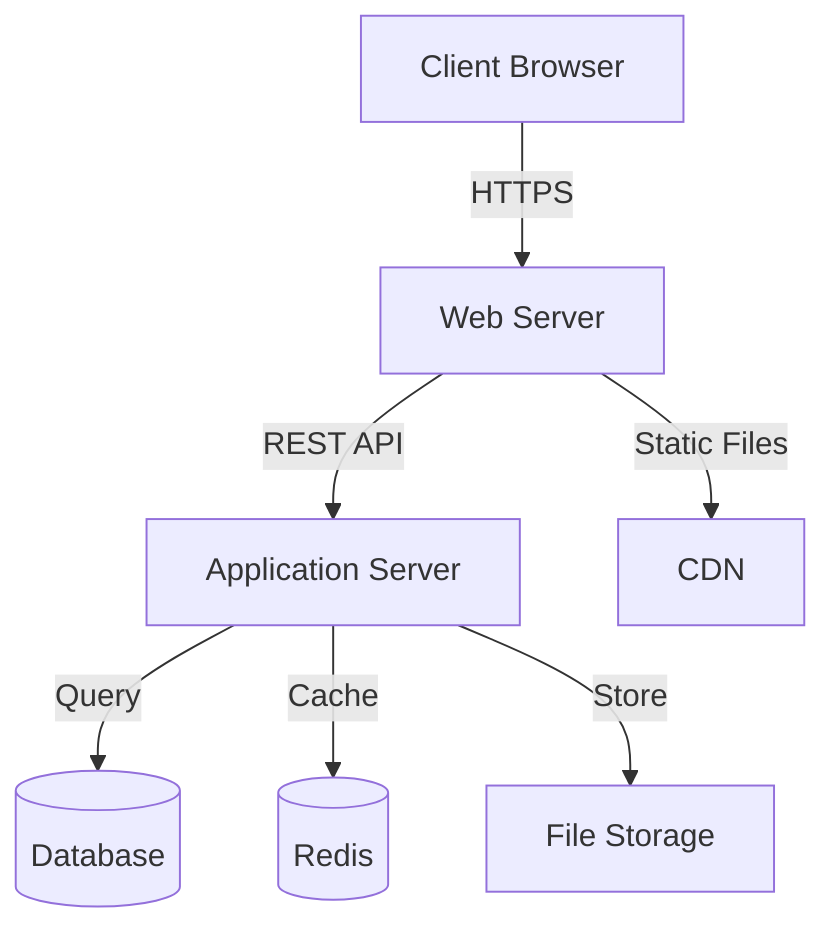

# 🌱 Charity Management System

<div align="center">


### 💝 Streamline charity operations with transparency and efficiency

*A comprehensive platform connecting donors, administrators, and beneficiaries*

[Features](#-key-features) • [Installation](#-installation--setup) • [Documentation](#-usage-guide) • [Contributing](#-contribution-guidelines)

</div>

---

## 📖 About the Project

<div align="center">


</div>

The **Charity Management System** is a full-stack web application designed to revolutionize how charitable organizations operate. By digitizing donation tracking, campaign management, and administrative workflows, we're creating a more transparent and efficient ecosystem for philanthropy.

> 🎯 **Mission**: Transform traditional charity operations into a digital, transparent, and scalable platform that builds trust between all stakeholders.

### 🌟 Why This Project?

Traditional charity operations face several challenges:
- 📋 Manual tracking and fragmented systems
- 🔍 Lack of transparency for donors
- ⏱️ Time-consuming administrative tasks
- 📊 Limited data insights and reporting

**Our Solution**: A centralized platform that ensures **transparency, scalability, and ease of use** for everyone involved.

---

## 🎯 Project Objectives

<table>
<tr>
<td width="50%">

### 🎨 Primary Goals
- ✅ **Digitize** charity and donation management
- ✅ **Provide** transparent system for donors
- ✅ **Simplify** administrative workflows

</td>
<td width="50%">

### 🚀 Secondary Goals
- ✅ **Improve** trust and accountability
- ✅ **Ensure** secure data handling
- ✅ **Enable** real-time tracking and reporting

</td>
</tr>
</table>

---

## ✨ Key Features

### 👥 User Management
<details open>
<summary><b>Click to expand</b></summary>

- 🔐 **Secure Authentication**
  - User registration with email verification
  - JWT-based authentication
  - Password encryption and secure storage
  
- 🎭 **Role-Based Access Control (RBAC)**
  - Admin, Donor, Beneficiary, and Volunteer roles
  - Permission-based feature access
  - Hierarchical user management
  
- 🔒 **Session Management**
  - Secure session handling
  - Auto-logout on inactivity
  - Multi-device login support

</details>

### 💰 Donation Management
<details open>
<summary><b>Click to expand</b></summary>

- 📝 **Donation Tracking**
  - Real-time donation recording
  - Multiple payment method support
  - Automated receipt generation
  
- 📊 **Donation Analytics**
  - Personal donation history
  - Campaign-wise contribution tracking
  - Tax-deductible donation reports
  
- 💳 **Payment Integration**
  - Secure payment gateway
  - Recurring donation options
  - Multiple currency support

</details>

### 📢 Campaign Management
<details open>
<summary><b>Click to expand</b></summary>

- 🎨 **Campaign Creation**
  - Rich text editor for campaign details
  - Image and video upload support
  - Goal setting and deadline management
  
- 📈 **Progress Tracking**
  - Real-time funding progress
  - Milestone notifications
  - Success metrics and KPIs
  
- 🔔 **Campaign Updates**
  - Regular status updates to donors
  - Impact reports and testimonials
  - Automated thank-you messages

</details>

### 🛠️ Admin Dashboard
<details open>
<summary><b>Click to expand</b></summary>

- 📊 **Analytics & Reporting**
  - Interactive charts and graphs
  - Export reports (PDF, CSV, Excel)
  - Custom date range filtering
  
- 👤 **User Management**
  - View and manage all users
  - Role assignment and permissions
  - Activity monitoring and logs
  
- ✅ **Approval Workflows**
  - Campaign approval system
  - Donation verification
  - Beneficiary validation

</details>

### 🔒 Security Features
<details open>
<summary><b>Click to expand</b></summary>

- 🛡️ **Data Protection**
  - End-to-end encryption
  - Secure API endpoints with authentication
  - SQL injection prevention
  
- ✅ **Input Validation**
  - Client-side and server-side validation
  - XSS attack prevention
  - CSRF token implementation
  
- 🔐 **Compliance**
  - GDPR compliant data handling
  - PCI DSS for payment security
  - Regular security audits

</details>

---

## 🏗️ System Architecture



<div align="center">

**Architecture Pattern**: Client-Server Architecture  
**Design Pattern**: MVC (Model-View-Controller)  
**API Style**: RESTful API

</div>

---

## 💻 Technology Stack

<div align="center">

### Frontend


### Backend


### Tools & DevOps


</div>

---

## 📁 Folder Structure

```
📦 charity-management-system
├── 📂 client/                    # Frontend application
│   ├── 📂 public/
│   ├── 📂 src/
│   │   ├── 📂 components/        # React components
│   │   ├── 📂 pages/             # Page components
│   │   ├── 📂 services/          # API services
│   │   ├── 📂 utils/             # Utility functions
│   │   ├── 📂 assets/            # Images, fonts, etc.
│   │   └── 📄 App.js             # Main app component
│   └── 📄 package.json
│
├── 📂 server/                    # Backend application
│   ├── 📂 config/                # Configuration files
│   ├── 📂 controllers/           # Route controllers
│   ├── 📂 models/                # Database models
│   ├── 📂 routes/                # API routes
│   ├── 📂 middleware/            # Custom middleware
│   ├── 📂 utils/                 # Helper functions
│   └── 📄 server.js              # Entry point
│
├── 📂 tests/                     # Test files
├── 📄 .env.example               # Environment template
├── 📄 .gitignore
├── 📄 README.md
└── 📄 LICENSE
```

---

## 🚀 Installation & Setup

### Prerequisites

Before you begin, ensure you have the following installed:

-  or higher
-  or higher
-  or 

### 📥 Step-by-Step Installation

<details>
<summary><b>1️⃣ Clone the Repository</b></summary>

```bash
git clone https://github.com/yourusername/charity-management-system.git
cd charity-management-system
```

</details>

<details>
<summary><b>2️⃣ Install Dependencies</b></summary>

```bash
# Install backend dependencies
cd server
npm install

# Install frontend dependencies
cd ../client
npm install
```

</details>

<details>
<summary><b>3️⃣ Environment Configuration</b></summary>

Create `.env` files in both client and server directories:

**Server `.env`:**
```env
PORT=5000
MONGODB_URI=mongodb://localhost:27017/charity_db
JWT_SECRET=your_jwt_secret_key_here
JWT_EXPIRE=7d
NODE_ENV=development
EMAIL_SERVICE=gmail
EMAIL_USER=your_email@gmail.com
EMAIL_PASS=your_app_password
```

**Client `.env`:**
```env
REACT_APP_API_URL=http://localhost:5000/api
REACT_APP_ENV=development
```

</details>

<details>
<summary><b>4️⃣ Database Setup</b></summary>

```bash
# Start MongoDB
mongod

# Import sample data (optional)
cd server
npm run seed
```

</details>

<details>
<summary><b>5️⃣ Run the Application</b></summary>

```bash
# Run backend (from server directory)
npm run dev

# Run frontend (from client directory, in a new terminal)
npm start
```

The application will be available at:
- Frontend: `http://localhost:3000`
- Backend API: `http://localhost:5000`

</details>

---

## 📘 Usage Guide

### 👤 User Roles

| Role | Permissions | Access Level |
|------|-------------|--------------|
| 🔵 **Admin** | Full system access, user management, approval workflows | High |
| 🟢 **Donor** | Make donations, view history, track campaigns | Medium |
| 🟡 **Beneficiary** | Create campaigns, receive donations, update progress | Medium |
| 🟣 **Volunteer** | Assist campaigns, view reports | Low |

### 🔄 Common Workflows

<details>
<summary><b>Making a Donation</b></summary>

1. Browse active campaigns
2. Select a campaign
3. Choose donation amount
4. Complete payment
5. Receive confirmation and receipt

</details>

<details>
<summary><b>Creating a Campaign</b></summary>

1. Login as Admin/Beneficiary
2. Navigate to "Create Campaign"
3. Fill in campaign details
4. Upload images/videos
5. Submit for approval
6. Launch campaign after approval

</details>

---

## 🔐 Security Considerations

### 🛡️ Implemented Security Measures

- ✅ **Authentication**: JWT-based token authentication
- ✅ **Authorization**: Role-based access control (RBAC)
- ✅ **Encryption**: bcrypt for password hashing
- ✅ **Input Validation**: Express-validator for API requests
- ✅ **Rate Limiting**: Prevent brute force attacks
- ✅ **CORS**: Configured for secure cross-origin requests
- ✅ **Helmet.js**: HTTP header security
- ✅ **XSS Protection**: Sanitize user inputs

### 🔒 Best Practices

- Never commit `.env` files
- Use strong, unique passwords
- Regularly update dependencies
- Implement 2FA for admin accounts
- Regular security audits
- Monitor logs for suspicious activity

---

## 🚀 Future Enhancements

<div align="center">

### 📅 Roadmap

</div>

| Phase | Feature | Status |
|-------|---------|--------|
| 🔵 **Phase 1** | Mobile application (React Native) | 📋 Planned |
| 🟢 **Phase 2** | Advanced analytics dashboard | 📋 Planned |
| 🟡 **Phase 3** | Payment gateway integration (Stripe, PayPal) | 📋 Planned |
| 🟣 **Phase 4** | Multi-language support (i18n) | 📋 Planned |
| 🔴 **Phase 5** | AI-powered donation recommendations | 💡 Research |
| 🟠 **Phase 6** | Blockchain for transparency | 💡 Research |

### 💡 Additional Ideas

- 📱 SMS notifications for donors
- 🤖 Chatbot for donor support
- 📊 Impact visualization tools
- 🌍 Geolocation-based campaigns
- 📧 Email marketing integration
- 🎁 Reward system for regular donors

---

## 🧪 Testing

### Running Tests

```bash
# Run all tests
npm test

# Run tests with coverage
npm run test:coverage

# Run specific test suite
npm test -- --grep "Donation"
```

### Test Coverage

- Unit Tests: ✅ Controllers, Models, Utilities
- Integration Tests: ✅ API Endpoints
- E2E Tests: ⏳ Coming Soon

---

## 🤝 Contribution Guidelines

We welcome contributions! Please follow these steps:

### 🌟 How to Contribute

1. **Fork** the repository
2. **Create** a feature branch (`git checkout -b feature/AmazingFeature`)
3. **Commit** your changes (`git commit -m 'Add some AmazingFeature'`)
4. **Push** to the branch (`git push origin feature/AmazingFeature`)
5. **Open** a Pull Request

### 📝 Code Style

- Follow ESLint configuration
- Write meaningful commit messages
- Add comments for complex logic
- Update documentation for new features

### 🐛 Reporting Bugs

Use GitHub Issues and include:
- Bug description
- Steps to reproduce
- Expected vs actual behavior
- Screenshots (if applicable)

---

## 📄 License

<div align="center">

This project is licensed under the **MIT License** - see the [LICENSE](LICENSE) file for details.

[](https://opensource.org/licenses/MIT)

</div>

---

## 🙏 Acknowledgements

<div align="center">

Special thanks to:

- 💚 All contributors who help improve this project
- 🎨 [Shields.io](https://shields.io/) for awesome badges
- 📚 Open source community for inspiration
- ❤️ Everyone working to make the world a better place

### 📞 Connect With Us

[](https://github.com/yourusername)
[](https://linkedin.com/in/yourprofile)
[](https://twitter.com/yourhandle)

</div>

---

<div align="center">

### ⭐ Star this repository if you find it helpful!

**Made with ❤️ for making a difference in the world**

<sub>Built with passion for social good</sub>

</div>
